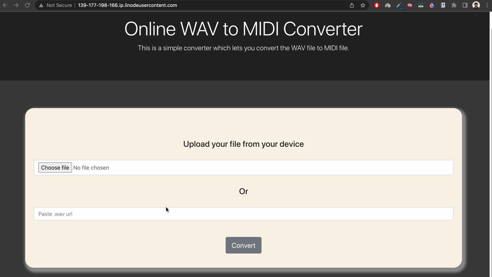
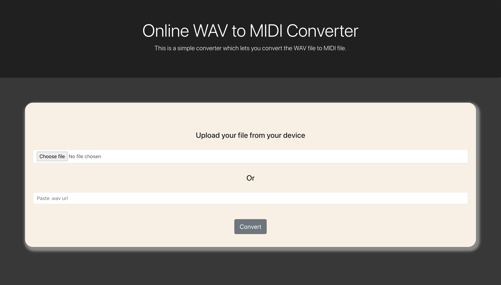

# Media Convertor Application
## _Assignment Project_

Media Convertor is a cloud-based WAV to MIDI convertor system.

- [Requirements](#requirements)
- [Working Demo](#wokring-demo)
- [Tech Stack](#tech-stack)
- [Local Machine Setup](#local-machine-setup)
    - [Python & Pip Installation](#local-machine-setup)
    - [Installing virtualenv](#local-machine-setup)
    - [Cloning the repository](#local-machine-setup)
    - [Activating the virtual env](#local-machine-setup)
    - [Installing all the required libraries and dependencies](#local-machine-setup)
    - [Migrating tables for the first time](#local-machine-setup)
    - [Running the server on local](local-machine-setup)


## Requirements
- Webpage should have an option to upload the WAV file for conversion 
- Webpage should allow link of WAV instrumental music file as input for conversion
- After File conversion is complete, the MIDI file should be automatically downloaded

## Working Demo


## Tech Stack

Important libraries and frameworks used in this project:

- [Python](https://www.python.org/) - _3.8.10_, Interpreted object-oriented programming language
- [Django](https://www.djangoproject.com/) - _3.2.8_, High-level Python web framework that encourages rapid development and clean, pragmatic design
- [SQLite](https://www.sqlite.org/index.html) - _1.4.2_, In-built Light Weight Database
- [gunicorn](https://gunicorn.org/) - Python WSGI HTTP Server for UNIX

## Local Machine Setup

### Step 1:
##### Python and Pip Installation

You may have python preinstalled. To verify other python requirements Installation, Run:
```sh
sudo apt-get install python3-pip python3-dev libpq-dev libsndfile1
```

### Step 2:
Installing virtualenv:
```sh
sudo -H pip install virtualenv
```

### Step 3:
Cloning the repository:
```sh
git clone https://github.com/nischay-dhiman/media-convertor.git
cd media-convertor
```

### Step 4:
Activating the virtual env:
```shell
virtualenv MediaConvertor
source MediaConvertor/bin/activate
```

### Step 5:
Installing all the required libraries and dependencies
```sh
pip install -r requirements.txt
```

### Step 6:
Migrating tables for the first time
```sh
python manage.py migrate
```

### Step 7:
Running the server on local
```sh
python manage.py runserver 0.0.0.0:8000
```
We can check website on our local machine browser:
```
http://0.0.0.0:8000/
```
We should see something like this in the browser:



