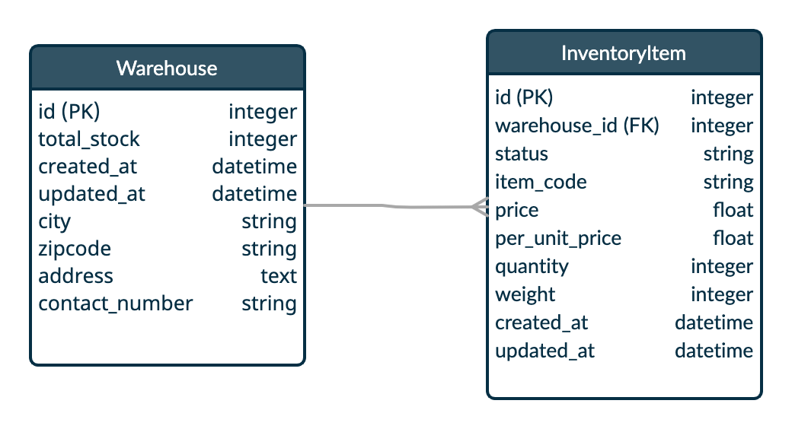

# Media Convertor
## Internship Project 1

## Sample Documentation, Update pending

Media Convertor is a cloud-based media convertor system.

- [Requirements](#requirements)
- [Additional Features](#additional-features)
- [Project Architecture](#project-architecture) 
- [Working Demo](#wokring-demo)
- [Tech Stack](#tech-stack)
- [Replit Quick Setup](#replit-quick-setup)
    - [Import github Repository](#replit-quick-setup)
    - [Installing libraries](#replit-quick-setup)
    - [Database setup](#replit-quick-setup)
    - [Running the Rails server on Replit](#replit-quick-setup)
- [Local Machine Setup](#local-machine-setup)
    - [Ruby install](#local-machine-setup)
    - [Rails install](#local-machine-setup)
    - [SQLite3 install](#local-machine-setup)
    - [Cloning the repository](#local-machine-setup)
    - [Installing libraries](#local-machine-setup)
    - [Database setup](#local-machine-setup)
    - [Running the Rails server on local machine](local-machine-setup)
- [Running Testcases](#running-testcases)
- [Future Scope](#future-scope)

## Requirements
- Upload Media file
- Convert media file to midi
- Download media file


## Project Architecture

The Project mainly contains two modules
- Warehouses
    - Contains warehouse address and contact information
    - Contains count of total inventory items present in warehouse
- Inventory Items
    - Contains Item information
    - Contains warehouse information, where it is stored
    - Contains status of inventory item: (Received, Off-Loaded, Ready to Ship)

#### DB architecture:

    
#### Associations:
- A warehouse can have multiple Inventory Items
- Inventory Item belongs to a warehouse 

## Working Demo


## Tech Stack

Important libraries and frameworks used in this project:

- [Ruby](https://github.com/ruby/ruby) - _3.0.3_, Interpreted object-oriented programming language
- [Rails](https://github.com/rails/rails) - _7.0.3_, Web-application framework based on [MVC](https://en.wikipedia.org/wiki/Model-view-controller) pattern
- [SQLite](https://www.sqlite.org/index.html) - _1.4.2_, In-built Light Weight Database
- [rspec-rails](https://github.com/rspec/rspec-rails/tree/6-0-maintenance) - _5.1.2_, Testing Framework, alternative to Minitest.
- [puma](https://github.com/puma/puma) - _5.6.4_, HTTP server for Ruby/Rack applications


## Replit Quick Setup


### Step 1:

Import the repository in replit

https://github.com/nischay-dhiman/media-convertor

### Step 2:

In shell section of replit, run following command

```sh
bundle
```

### Step 3:

Creating the Database defined in database.yml for developement and test environments

```sh
rails db:create
```

### Step 4:

Migrating the tables

```sh
rails db:migrate
```

### Step 5:

Seed the warehouse table with two warehouses

```sh
rails db:seed
```

### Step 6:

Run the rails server with binding on 0.0.0.0 for replit

```sh
rails s -b 0.0.0.0
```

After this, we can check on the replit preview window for demo.
or check this url:
[https://dhimanlogistics.nischaydhiman.repl.co/](https://dhimanlogistics.nischaydhiman.repl.co/)


## Local Machine Setup

### Step 1:
##### Ruby Installation

You may have ruby preinstalled. To verify Ruby Installation, Run:
```sh
ruby -v
```
If not, follow this [link](https://www.ruby-lang.org/en/documentation/installation/) to install ruby for various OS.
### Step 2:
##### SQLite Installation:

Many popular UNIX-like OSes ship with an acceptable version of SQLite3. 
On Windows, if you installed Rails through Rails Installer, you already have SQLite installed. 
Others can find installation instructions at the [SQLite3 website](https://www.sqlite.org/). 

To Verify that it is correctly installed and in your PATH:
```sh
sqlite3 --version
```

### Step 3
##### Rails Installation

We need the current latest version of rails.

```sh
gem install rails --version '7.0.3'
rails --version
```

Kindly follow the official Rails installation documentation in case of any issues:
[https://guides.rubyonrails.org/v5.0/getting_started.html](https://guides.rubyonrails.org/v5.0/getting_started.html)


### Step 4:
Cloning the repository:
```sh
git clone https://github.com/nischay-dhiman/dhiman_logistics.git
cd dhiman_logistics
```

### Step 5:
Installing all the gems libraries and dependencies
```sh
bundle
```

### Step 6:
Creating the database and migrating for the first time
```sh
rake db:create
rake db:migrate
rake db:seed
```

### Step 7:
Running the Rails server on local
```sh
rails s
```
We can check website on our local machine browser:
```
http://localhost:3000/
```
We should see something like this in the browser:


## Running Testcases

Added around 26 test cases majorly covering model level validations, callbacks

```sh
bundle exec rspec
```
  
## Future Scope  
- Add Authentication
